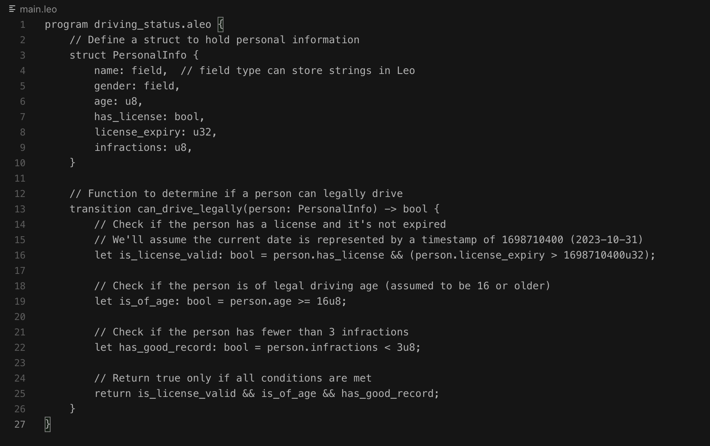

# Leo Program: Legal Driving Status Without Revealing Personal Information

This Leo program demonstrates how to determine if someone can legally drive, while keeping other personal details confidential. Here's a breakdown of how the program works:

## Program Overview

We define a `PersonalInfo` struct that contains various personal details related to driving, such as:

- Name
- Gender
- Age
- License status
- License expiry
- Number of infractions

The `can_drive_legally` transition function takes a `PersonalInfo` struct as input and returns a boolean value indicating whether the person can legally drive.

## Conditions for Legal Driving

Within the `can_drive_legally` function, we check the following conditions:

1. **Valid License:** The person must have a valid (non-expired) license.
2. **Legal Driving Age:** The person must be of legal driving age (assumed to be 16 or older).
3. **Infractions:** The person must have fewer than 3 infractions.

The function returns `true` only if **all** of these conditions are met, without revealing any specific personal details.

## Example Usage

The `example` function illustrates how this could be used in practice. It creates a `PersonalInfo` instance with sample data and then calls `can_drive_legally` to check the person's driving status.

## Real-World Application

To use this in a real Aleo application:

1. Deploy this program to the Aleo network.
2. Call the `can_drive_legally` transition function with your actual personal information.

The Aleo network will execute the function and return only whether you can legally drive or not, without exposing any other personal data.

## Leo code

## Result

## Privacy Features

This program leverages Aleo's privacy features to ensure that only the specific information you want to share (legal driving status) is revealed. Sensitive personal data remains confidential, enhancing privacy protection.

---

By utilizing Aleo's platform, this program helps protect privacy while still offering verifiable results on specific conditions, like legal driving eligibility.
